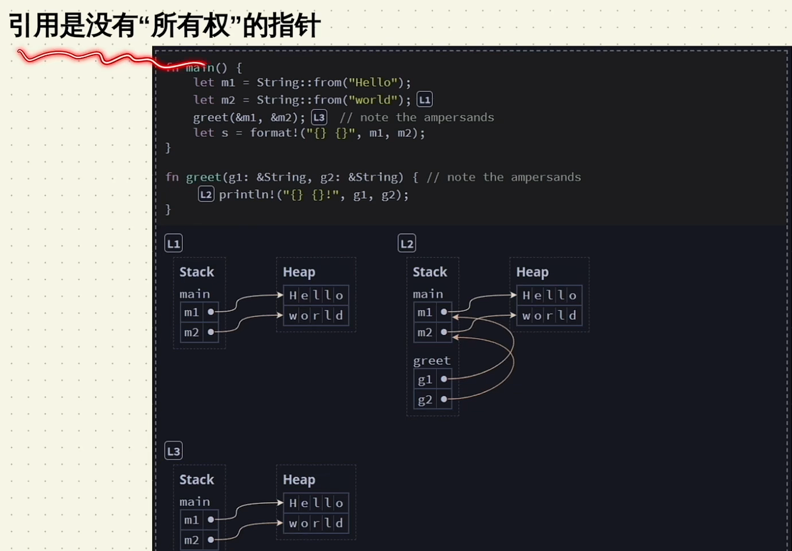
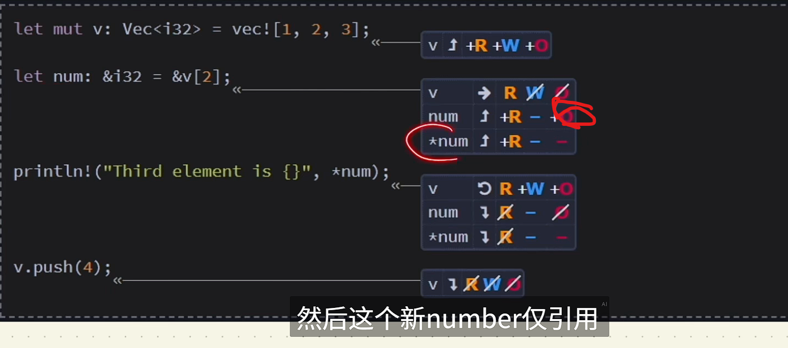
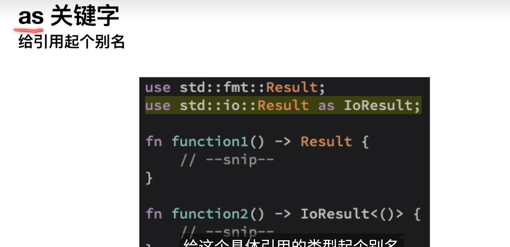

# 入门

cargo命令

cargo new packageName


# 猜数字

定义变量

```rust
  let mut guess = String::new();
    let nums1 =1;
    let mut nums2 =2;   mut将变量标记为可变的
    nums1=2;   err
    nums2=3;   ok
```


添加外部库=crate

在tomlz文件中

库名=“版本号”

rand=xxxx


使用命令

cargo add rand xxxx版本号


cargo.lock文件记录了导入的相关依赖=crate


# 相关概念

静态static  编译时确定变量属性。

编译型语言：将代码编译成电脑可执行的文件。


stack栈内存和堆heap内存

栈 先进后出 

heap随机一块空间 有指针


# 基础语法和数据类型

## scalar标量类型

integer float boolean character

```rust
let a :u8 = 1;
let b = 1.1;
let c = true;
let d = 'a';
```

## compound

tuple 元组 不同类型的组合   长度固定

array 数组 相同类型的组合   长度固定

 

```rust
let tup =(1,2.2,'a');
//创建时 长度确定。

println!("{}",tup.0);

let arr = [1,2,3,4,5];

let ayy:[u32;3] = [1,6,7];

let auu =[3;5]; //auu数组里包含 5个3
println!("{}",auu[0]);
```


# 函数

函数和变量的命名规则 小写_拼接

fn 函数名(参数) -> 返回值类型 {


}

```rust
参数的类型要确定 xx:类型  返回值的类型要声明 
fn to_print(value:String){
    println!("{}", value);
}

fn add(a:u32,b:u32)->u32{
    a+b                     表达式==return a+b;  加上;就不会返回了
    // return a+b;
}
```


# 控制流

类型的三元表达式

```rust
let flag = true;
let res = if flag {1} else {2};
                   1        2   1和2的类型要相同因为，rust是强类型语言，需要在编译时确定属性的类型。
```


if

```rust
let mut a = 2; 

if a==1{              判断条件
    println!("1");
}
else if a==2{
    println!("2");
}
else{
    println!("else");
}
```


循环

loop

```rust
let mut a = 1;

res接受 break 后返回的值；
break结束循环
let res = loop{
    if(a == 10){
        break "is over";
    }
    println!("a is {a}");
    a = a + 1;
};

loop嵌套
"forntier";
    loop
    { loop {
        if (a == 10) {
            break a;
        }
        if(a==15){
            break "forntier";
        }
        println!("a is {a}");
        a = a + 1;
    }; 
    
    }

给外层loop循环一个标签，  break "forntier"; 就会结束外部的循环
```


while

```rust
let a = 1;
while a<10  {         while  判断的条件
    print!(" ");
}
```


for 通常用于数组的遍历

```rust
let arr = [1,2,3,4,5,6,7,8,9,10];


for i in arr{
    print!("{} ",i);
}
```


# 所有权

一组规则，在编译时使用这套规则检查。

三大原则

1. **每个值都有一个所有者（owner）**
2. **同一时间只能有一个所有者**
3. **当所有者离开作用域时，值将被丢弃（dropped）**

##   内存方面

stack frame    heap

rust 为在调用函数时为函数创建一个 stackframe。在调用结束后 回收stackFrame。数据也就消失了。

所有权转移，同一时间只有一个变量拥有所有权。可以使用clone,这就相当于使用了克隆，复制了一份数据。 在heap中有两份值

i32这种类型实现了 copy trail。 在let o：i32 = 1；

​							 let p = o；

这时stack frame中有两个 1的值。


## 引用

&变量




## 借用检查器

r 读取

w 修改

o 所有权


num所拥有o的权限是对 v[2]这个地址的权限， 他并不能转移和释放。

v失去了w的权限，是因为不可变引用不能和可变引用同时存在?   



引用可以临时移除这些权限

## 解引用

*变量

变量.fn()  会隐士解引用


## slice

&str 1.代表字面量 存储在 静态存储区  生命周期跟随整个程序

2.代表string的切片。

直接引用&String也会隐式转换成&str类型。 切片就显示的转换了。

函数的接受参数是&str类型，可以接受字面量和切片。

```rust
let s = String::from("hello world");

let hello:&str = &s[0..5];
```


# struct

```rust
struct people {
    name:String,
    age:u32,
    gender:u8,
}
  let p1 = people{name:"John".to_string(),age:20,gender:0};
```


```rust
fn new_people(name:&str, age:u32,gender:u8)->People{
  People{
      name:name.to_string(),
      age,   参数和接受参数名字相同可以不写
      gender,
    }
}
```


## tuple struct

```rust
struct point(f32,f32);
  
 
 let home = point(0.0, 0.0);
```


## 自定义struct如何直接打印

```rust
#[derive(Debug)]                    实现trait 相当于接口吧
struct point {x:i32,y:i32}

fn main() {
 
 let p = point {x:0,y:0};
 
 println!("point is {:#?}",p);
}
```


## 定义方法

```rust
struct Point {x:i32,y:i32}

impl Point {
 
 fn area(&self)->i32{   &self 调用者本身的引用
  self.x*self.y
 }
 
}

let p = Point { x:2,y:5};
 let res = p.area();        
```


## 实现copy clone trait

```rust
#[derive(Debug,Copy, Clone)]
struct Point {x:i32,y:i32}

实现后， &self  还是self。 都会执行copy操作。像i32那样。 而不会移动所有权
```


## 静态方法

```rust
 fn square(i:i32)->Self{
  Self{x:i,y:i}
 }
}
fn main() {
 let mut p = Point::square(1);
}
```

# 枚举

枚举可以绑定值

(指定值的类型)

枚举可以有方法

```rust
enum Msg{
 Quit,
 Write(String),
 Move{x:i32,y:i32},
 add(i32,i32),
}

impl Msg{
 fn call(&self){
  
 }
}
fn main() {
 let m1 = Msg::add(),
}
```


枚举option<T>{

none,

some(T)

}


处理null的情况

# match

必须考虑所有结果

多种选择时可以使用

```rust
match res {
 IpAdd::v4=>{
  //可以是值
  //可以是一个函数
  println!("v4");
 },
 default=>{
  println!("其他默认情况");
 }
}
```


```rust
enum IpAdd{
 v4,
 v6(i32)
}
fn main() {
 
 let i1 = IpAdd::v6(10);
 
 te(i1);
 
 fn te(res:IpAdd){
  match res {
   IpAdd::v4=>{
    //可以是值
    //可以是一个函数
    println!("v4");
   },
   IpAdd::v6(i32)=>{
    println!("v6")
   }
  }
  
 }
}
```


# if let

匹配一种情况

```rust
fn main() {
 
 let num1:Option<u16> = Some(3u16);
 
 if let Some(m) = num1 {
    println!("{}",m)
 }
 else { println!("None"); }
}
```


# 项目架构

| 特性             | Binary Crate    | Library Crate         |
| :--------------- | :-------------- | :-------------------- |
| **入口函数**     | 必须有 `main()` | 无 `main()`           |
| **输出类型**     | 可执行文件      | `.rlib` 库文件        |
| **主要用途**     | 直接运行        | 被其他代码引用        |
| **典型文件位置** | `src/main.rs`   | `src/lib.rs`          |
| **依赖关系**     | 可依赖库箱      | 可被二进制/其他库依赖 |
| **Cargo 命令**   | `cargo run`     | `cargo build`         |
| **发布目的**     | 终端用户        | 开发者                |


## module

创建 

1.lib.rs

​	mod modules

2.modules.ra

​	mod yesNo===从modules文件夹下去找mod/

3.moudules文件夹

​	4.mod yesNo


### 引入本地mod

模块被pub修饰 。  逐级都要修饰

struct的字段也要被pub修饰，外部才能修改

```rust
use h1::modules::enums::YesNo;
```


引入了相同的库




引入多个库

```rust
use h3::modules::{enums,pep};

use h3::modules::*; 全部
```


# 常见集合

## vector<T>

单一数据结构存储多个值

在内存中连续存储


```rust
let v = vec![1,2,3];
let mut v1:Vec<i32>= Vec::new();
   
   v1.push(1);
   v1.push(2);
   v1.push(3);
   
   let n1: Option<&i32>= v1.get(0); //返回的是option<$i32>
   let n2:&i32 = &v1[0];                //&i32
   
   for n_ref in &v1 {    // n_ref得到的是 &v1[0,1,2] 索引的引用
       let n = *n_ref+1;  // *n_ref解引用得到值
       println!("{}",n);
   }
```


iter()迭代遍历循环

 iter.next向后移动。返回前一个数据的引用

如果iter.next向后移动两次了都是none，那就返回option none

```rust
let  mut v = vec![1,2];
  
  let mut iter = v.iter();
  
  let n0 = iter.next().unwrap();  // iter.next
  let n1 = iter.next().unwrap();
  let n2 = iter.next();
  
  println!("{:?}", n0);
  println!("{:?}", n1);
  println!("{:?}", n2);
  
```


## String

```rust
let mut s1 = String::from("hello");   String:  heap
let s2 = "world";                     &str : static storage


let s4 = format!("{s1}-{s2}");          拼接

let s3 = s1 + s2;   // 第一个变量的所有权会移动到s3。
```


遍历

```rust
let mut s1 = String::from("范子阳");

for i1 in s1.chars() {
    print!("{} ", i1);  // 范  子 阳 
}

for i2 in s1.bytes(){
    print!("{} ", i2);  // 232 140 131===229 173 144=== 233 152 179
}
```